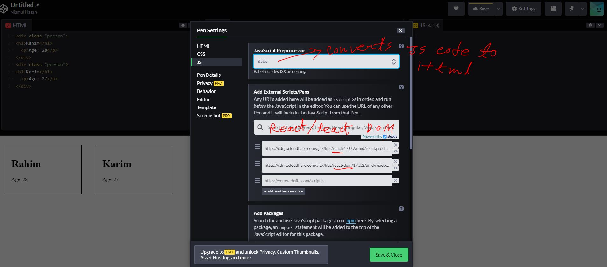

## React_learning
#### Need to install Node.js
#### node packages: https://www.npmjs.com/package/date-format
#### '$npm help': show alo the command that i can use.
### import file, export file: use another file's code: https://www.w3schools.com/react/tryit.asp?filename=tryreact_es6_module1
for more: https://developer.mozilla.org/en-US/docs/web/javascript/reference/statements/export

## 1. create a NPM project(MyApp), see rest of the npm learing in: https://github.com/niamul64/React_learning/tree/main/NodeJs%20before%20react%20learning

<br><hr>

## REACT.js starting: to do raw code: https://codepen.io/pen : login with github : react use: JSX code
### we write components in in react
### 1. To write react code: in->https://codepen.io/pe --> we need   babel(converts in to html), react, react dom

<br>

### Now, write a simple code at  https://codepen.io/pen, to show name, and age of three person with one div in html page.
```
<!-- HTML -->           | <!-- CSS -->            | <!-- React.js -->        
...............................................................................................   
<div id="app">          |.person {                |function Person(props) {   // parameter pass
  <!--come form react-->|  display: inline-block; |  console.log(props);
</div>                  |  border: 1px solid;     |  return (    //JSX code
                        |  width: 200px;          |    <div className="person">
                        |  width: 200px;          |      <h1>Name: {props.name}</h1>
                        |  padding: 20px;         |      <p>Age: {props.age}</p>
                        |  margin: 20px;          |    </div>
                        |}                        |  ); //JSX code
                        |                         |}
                        |                         |
                        |                         |let persons = ( // jsx code// jsx code
                        |                         |  <div>
                                                  |
                                                  |    <Person name="karim" age="27" />
                                                  |    <Person name="kabir" age="29" />
                                                  |    <Person name="Rahim" age="33" />
                                                  |   </div>
                                                  |  ); // jsx code
                                                  |
                                                  |ReactDOM.render(persons, document.getElementById("app")); // rendering to HTML page
```


